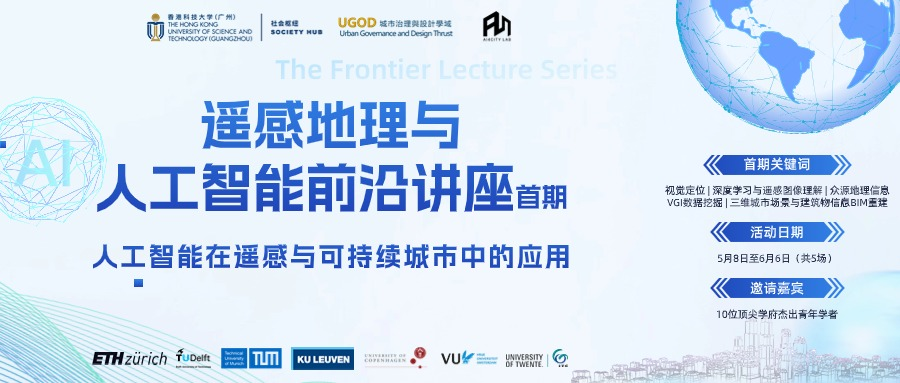

Dr. Wufan Zhao is currently an Assistant Professor at [the Urban Governance and Design (UGOD) Thrust](https://soch.hkust-gz.edu.cn/academics/ugod/), [The Hong Kong University of Science and Technology (Guangzhou)](https://www.hkust-gz.edu.cn/). He is the Principal Investigator (PI) of AI4DCity Lab. Before joining HKUST(GZ), he was a Research Fellow at Geomatics Group, KU Leuven. His research primarily focuses on AI-based remote sensing image understanding, 3D city modeling, multi-modal spatiotemporal data fusion, and their methodological and applied studies. His researches will specifically addresses challenges related to urban environments and socio-economic factors under various scales of Sustainable Development Goals (SDGs).

Education
======
* PhD in Remote sensing and Earth Observation, ITC, University of Twente (2022)
* MSc in Geoinformatics, Nanjing Normal University & University of Salzrburg (2018)
* BSc in GIS, Northwest A&F University (2015)

Awards
======
<!-- *    Zhejiang Provincial Youth Talent Program, 2023 -->
*   [Top 30 reviewers](https://www.sciencedirect.com/journal/isprs-journal-of-photogrammetry-and-remote-sensing/about/news#appreciation-for-the-reviewers-for-the-calendar-year-2023) of the ISPRS Journal of Photogrammetry and Remote Sensing for 2023.
*   UTwente ITC Ph.D. Publication Award, 2022
*   CSC Scholarship, 2018-2022

Research Interests
======
* AI based remote sensing data processing and 3D modeling
* Spatio-temporal data science and digital twin cities
* Urban complex systems and uncertainty

News
======
<!-- * The Photogrammetric Engineering & Remote Sensing [(PE&RS)](https://my.asprs.org/pers) journal, established in 1935 by the American Society for Photogrammetry and Remote Sensing (ASPRS), cordially invites esteemed researchers and scholars to submit high-quality manuscripts.  -->

* **[2025.07]** Join us at the UGOD Summer AI Symposium on July 9, 2025, at HKUST (Guangzhou). With the theme "Intersecting Futures: Human - Centered AI for Smart Cities," professors from UGOD and other thrusts will give presentations on topics including Urban Computing and Cognition, Urban Mapping, Modeling and Visualization, Urban Design and Planning, and AI in Urban Systems.[More details](https://mp.weixin.qq.com/s/_J4I0u5Gbo-ZW9ag9yDUmQ)

* **[2025.06]** We have recently initiated a special issue on "Semantic Understanding of Multi-modal Remote Sensing Data" in The Photogrammetric Engineering & Remote Sensing [(PE&RS)](https://my.asprs.org/pers) on an invitation basis. We cordially invite esteemed researchers and scholars to submit high-quality manuscripts. 

* **[2024.11]** It was a privilege to have Prof. Dr. Alfred Stein from Faculty of Geo-Information Science and Earth Observation (ITC) of the University of Twente, visit our campus and AI4DCity Lab!

* **[2024.09]** We're organizing an session titled "Scan-to-BIM/CIM: Digital Innovations and Applications" for the ISDE-The 2nd Youth Innovation Forum on Digital Earth from December 4-7, 2024, in Hong Kong, China. We hope to see you there! For details and registration, visit the official website [link](https://www.isde-ysin.org/2024/#/).

 
      

* **[2024.09]** Pleased to have hosted Prof. Filip Biljecki and his PhD student Xiucheng Liang from NUS at HKUST Guangzhou for enlightening exchanges!

* **_[2024.04.22]_**
Glad to announce the Series Webinar on AI for Remote Sensing and Sustainable Cities. From May 8th to June 6th, our lab will have the honor of hosting 10 distinguished young scholars from leading European institutions to share their insights. Stay tuned! Check the details [here](https://mp.weixin.qq.com/s/YDy10ISAOWq_eQ9ZOlCIdg)!

 
      

* We are delighted to have hosted the "AI in Remote Sensing and Sustainable Cities" series webinars with CPGIS. The live broadcast replay can be viewed through the [link](https://space.bilibili.com/3546668626610569/video). Everyone is welcome to follow and participate in the subsequent lecture events.
* **[2024.03]** Dr. Wufan Zhao has been shortlisted in the [Top 30 reviewers](https://www.sciencedirect.com/journal/isprs-journal-of-photogrammetry-and-remote-sensing/about/news#appreciation-for-the-reviewers-for-the-calendar-year-2023) of the ISPRS Journal of Photogrammetry and Remote Sensing for 2023.
* Long-term openings for RA and PhD positions in the Lab. Applications are welcome, students with a master's degree background are preferred. PhD students will be admitted in January and September each year. Please refer to the [official guidelines](https://fytgs.hkust-gz.edu.cn/admissions) for more details.
* Undergraduate students are encouraged to apply for the [RedBird MPhil](https://www.hkust-gz.edu.cn/academics/teaching-and-learning-innovation/red-bird-mphil-program/) of HKUST-gz.
* Postdoc positions are open. Very competitive salary and research fund package. Welcome to drop your resume and research proposal.
