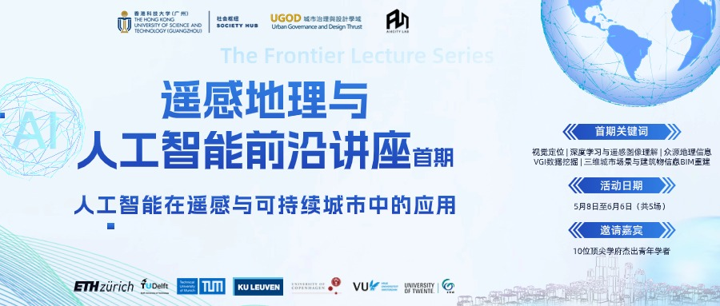



## About AI 4D City (AI4City) Lab

4D refers to 3D space plus time series modeling. As the type and density of the remote sensing data continue to grow exponentially, Dr. Wufan Zhao and his AI4City Lab aim to help pioneer computationally efficient AI-based processing and modeling strategies to solve complex and practical urban problems by integrating the multi- dimensional/modal characteristics of big earth observation data.

Our research is being conducted in two aspects. Firstly, a 3D city scene environment (including structured LoDs building models, infrastructures, land covers, etc.) reconstruction framework is being built on which any geo-referenced objects model at the instance level can be founded. Secondly, it is being studied how GIS, IoT data can be modeled in an nD way accordingly for specific application fields (e.g., built-environment, human dynamic, public health, urban climate, etc.)

Our research is both mission- and impact-oriented. We integrate data analytics and modeling technologies to achieve specific goals and contribute to the public good. Whether we are developing a physical product, analyzing trends at micro and macro levels, or creating new processes for optimal efficiencies, our work is always focused on sustainable development of the urban environment.

## Lab's Events

**_About_**
The AI4City Academic Lecture Series aims to help our students stay connected with researchers in related fields. At the same time, we also hope to be at the cutting edge of AI and Earth observation and make key contributions to solving practical urban problems, as well as facilitating technology transfer. We encourage the scientific community and the general public interested in these topics to join our hybrid seminars. If you are interested in attending a particular seminar, please send an email to ai4city.hkust@outlook.com with the title of the talk as the subject.
We look forward to meeting you soon!

**_[2024.04.22]_**
Glad to announce the Series Webinar on AI for Remote Sensing and Sustainable Cities. From May 8th to June 6th, our lab will have the honor of hosting 10 distinguished young scholars from leading European institutions to share their insights. Stay tuned! Check the details [here](https://mp.weixin.qq.com/s/YDy10ISAOWq_eQ9ZOlCIdg)!

 
      

## Current Members

**_Ph.D. students_**

- **[Tongyan Hua](https://thua919.github.io/)** (from Sep. 2024), MSc from TU Delft and Leiden University.\\
  Research fields: 3D city reconstruction, NeRF and SLAM.
- **[Shuai Zhang](https://www.researchgate.net/profile/Shuai-Zhang-194/research)** (from Sep. 2024), MSc from Sun Yat-sen University.\\
  Research fields: Point cloud processing and foundation model.
- **[Liang Zeng (co-supervisor)](https://iiw.kuleuven.be/onderzoek/geomatics/people/00159796)** (since Oct. 2022), MSc from TU Delft.\\
  Research fields: Self-supervised learning, computer vision, multi-modal remote sensing processing.
- **[Suzanna Cuypers (co-supervisor)](https://iiw.kuleuven.be/onderzoek/geomatics/people/00130472)** (since Oct. 2022), MSc from KU Leuven.\\
  Research fields: Deep leanrning for remote sensing image analysis, land use classification.

**_M.Phil. students_**

<!-- * **Wenshuo Chao**, undergraduate from HKUST. -->

- **Junxing Luo** (since Jan. 2024), BSc from South China Normal University.\\
  Research fields: Built environment and infrastructure assessment, human mobility analysis.

**_Research Assistant_**

- **Zhiyuan Xu** (since Apr. 2024), BSc from Harbin University of Science and Technology and MSc from University of Bristol. Pre Back‑end Engineer at Huawei and ByteDance.\\
  Research fields: Remote sensing image analysis, machine learning.
- **Daxu Wei** (since Jun. 2024), MSc from Bartlett School of
  Architecture, University College London.\\
  Research fields: Urban design, generative AI, spatial analysis.
- **[Yunlei Su](https://suyunlei.github.io/homepage/)** (since Jul. 2024), MSc from National University of Singapore. Pre Front-end Engineer at CSCI.\\
  Research fields: WebGIS, Urban Digital Twins, 3D visualization, spatial analysis.
- **Guanyu Hou** (since Jun. 2024), MSc from Chinese Academy of Sciences.\\
  Research fields: Remote Sensing, urbanization and ecosystem.
- **Zhongcheng Hong** (since Jul. 2024), MSc from South China University of Technology.\\
  Research fields: 3D reconstruction & Self-supervised visual task.
- **[Zongrong Li](https://jasper0122.github.io/
)** (since Jun. 2024), MSc at University of Southern California.\\
  Research fields: GeoAI, CityLLM, Spatial Economics & Finance.

**_Visiting Scholars_**

- **[Jin Huang](https://yidahuang.github.io/)**, PhD candidate at TUDelft 3D Geoinformation Group.\\
  Research fields: 3D city reconstruction, computer graphics.
- **[Dr. Cai Wu](https://wucai.me/)**, PhD from ITC University of Twente.\\
  Research fields: GIS, urban morphology and urban design.
- **[Dr. Shaoqing Dai](https://gisersqdai.top/mycv/)**, Assistant research fellow at Wuhan University, PhD from ITC University of Twente.\\
  Research fields: Spatial-temporal data analysis, geo-health, spatial statistics.
- **[Xianwei Lv](https://jsjytx.neuq.edu.cn/info/1037/6198.htm)**, Lecturer at Northeastern University at Qinhuangdao, School of Computer and Communication Engineering.\\  
  Research fields: Remote sensing images interpretation, image segmentation, parallel computing.
- **Ruqiao Jiang**, Deputy Dean of [SIPSG Smart City Research Institute](https://www.dpark.com.cn/#/home). \\
  Research fields: Big geodata processing.

**_Visiting Student_**

- **Taiyu Zhao** (since Jun. 2024), BSc from Wuhan University, MSc at University of Cambridge\\
  Research fields: Urban Climate & Spatial Analysis.

**_Alumni_**

- **[Juran Zhang](https://www.linkedin.com/in/juran-zhang)** (from Mar to May 2024), MSc from UC Davis, and pre Team Lead at Amazon. \\
  Research fields: Remote sensing data processing, distributed computing.

## Cooperative Institutions

- [EOS Department](https://www.itc.nl/about-itc/scientific-departments/earth-observation-science/), [ITC](https://www.itc.nl/), [Univerisy of Twente](https://www.utwente.nl/en/)
- [Geomatics Group](https://iiw.kuleuven.be/onderzoek/geomatics/home), [Faculty of Engineering Technology](https://iiw.kuleuven.be/english/index.html), [KU Leuven](https://www.kuleuven.be/english/kuleuven)
- [3D geoinformation Group](https://3d.bk.tudelft.nl/), [TU Delft](https://www.tudelft.nl/en/)
- [Digital Terrain Analysis Group](http://schools.njnu.edu.cn/geog/person/guoan-tang), [School of Geography](http://schools.njnu.edu.cn/geog/), [Nanjing Normal University](https://en.njnu.edu.cn/)
