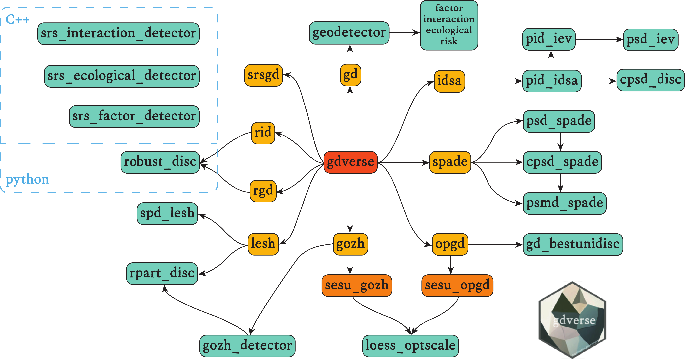



Display of Research Results
======

## 3D City Modeling

### · 3D Scene Reconstruction of HKUST-GZ using 3D Gaussian splatting

    <video width="50%" controls>
      <source src="../images/3drebuild.mp4" type="video/mp4">
      Your browser does not support the video tag.
    </video>

## Spatiotemporal Statistical Modeling

### · gdverse: An R package for spatial stratified heterogeneity family

Analyzing spatial factors and exploring spatial associations based on the concept of spatial stratified heterogeneity, while also taking into account local spatial dependencies, spatial interpretability, complex spatial interactions, and robust spatial stratification. Additionally, it supports the spatial stratified heterogeneity family established in academic literature.

    

Selected Publications 
======

* **Zhao, W.**, Persello, C. and Stein, A., 2023. [Semantic-aware Unsupervised Domain Adaptation for Height Estimation from Single-view Aerial Images](https://www.sciencedirect.com/science/article/pii/S0924271623000096). ISPRS Journal of Photogrammetry and Remote Sensing, 196, pp.372-385. (IF: 12.7)
* **Zhao, W.**, Persello, C. and Stein, A., 2022. [Extracting Planar Roof Structures from Very High Resolution Images Using Graph Neural Networks](https://www.sciencedirect.com/science/article/pii/S092427162200065X). ISPRS Journal of Photogrammetry and Remote Sensing, 187, pp.34-45. (IF: 12.7, **UTwente ITC Ph.D. Publication Award**)
* **Zhao, W.**, Persello, C. and Stein, A., 2021. [Building Outline Delineation: From Aerial Images to Polygons with An Improved End-To-End Learning Framework](https://www.sciencedirect.com/science/article/pii/S0924271621000551). ISPRS Journal of Photogrammetry and Remote Sensing, 175, pp.119-131. (IF: 12.7)
* **Zhao, W.**, Na, J., Ding, H., Li. M., and Tiede, D., 2023. [Height Estimation from Single Aerial Imagery Using Contrastive Learning based Multi-Scale Refinement Network](https://www.tandfonline.com/doi/full/10.1080/17538947.2023.2225881). International Journal of Digital Earth, 16(1), pp.2346-2364 (IF: 5.1)
* **Zhao, W.**, Persello, C., Lv, X., Stein, A. and Vergauwen, M., 2024. [Vectorizing planar roof structure from very high resolution remote sensing images using transformers](https://www.tandfonline.com/doi/full/10.1080/17538947.2023.2292637). International Journal of Digital Earth, 17(1), pp.1-15. (IF: 5.1)
* Lv, X., Persello, C., **Zhao, W.**, Huang, X., Hu, Z., Ming, D. and Stein, A., 2023. [Pruning for image segmentation: Improving computational efficiency for large-scale remote sensing applications](https://www.sciencedirect.com/science/article/pii/S0924271623001417). ISPRS Journal of Photogrammetry and Remote Sensing, 202, pp.13-29. (IF:12.7)
* Dai, S., **Zhao, W.**, Wang, Y., Huang, X., Chen, Z., Lei, J., Stein, A. and Jia, P., 2023. [Assessing spatiotemporal bikeability using multi-source geospatial big data: A case study of Xiamen, China](https://www.sciencedirect.com/science/article/pii/S1569843223003631). International Journal of Applied Earth Observation and Geoinformation, 125, p.103539. (IF:7.5)