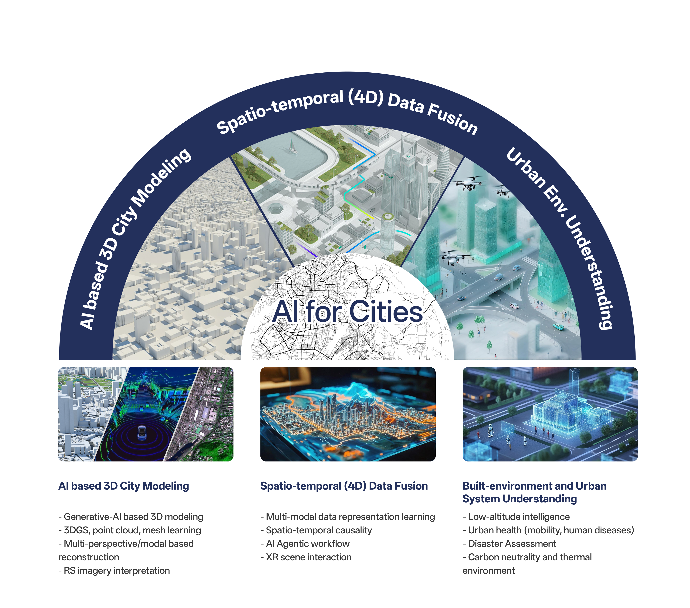





## About AI 4D City (AI4City) Lab

4D refers to 3D space plus time series modeling. As the type and density of the remote sensing data continue to grow exponentially, Dr. Wufan Zhao and his AI4City Lab aim to help pioneer computationally efficient AI-based processing and modeling strategies to solve complex and practical urban problems by integrating the multi- dimensional/modal characteristics of big earth observation data.

Our research is being conducted in two aspects. Firstly, a 3D city scene environment (including structured LoDs building models, infrastructures, land covers, etc.) reconstruction framework is being built on which any geo-referenced objects model at the instance level can be founded. Secondly, it is being studied how GIS, IoT data can be modeled in an nD way accordingly for specific application fields (e.g., built-environment, human dynamic, public health, urban climate, etc.)

Our research is both mission- and impact-oriented. We integrate data analytics and modeling technologies to achieve specific goals and contribute to the public good. Whether we are developing a physical product, analyzing trends at micro and macro levels, or creating new processes for optimal efficiencies, our work is always focused on sustainable development of the urban environment.

 
      

Research Interests
======

* AI遥感数据处理与三维建模
AI based remote sensing data processing and 3D modeling

* 时空数据挖掘与因果推断
Spatiotemporal data mining and causal inference

* 建成环境、空间智能体与人机交互
Built environment, spatial intelligence and human-computer interaction

* 双碳视角下的城市复杂系统与韧性
Urban complex systems and resilience from a dual carbon perspective

<!-- * Computer vision, deep learning, and algorithms for large-scale remote sensing image and point cloud processing. Key focuses include 2D/3D vision (Graph Convolution, self-supervised learning, Transfer learning), geometric deep learning, 3D point cloud/mesh processing/NeRF. 
* Urban computing and environmental modeling. Key focuses include fusion of multi-source spatio-temporal geospatial data, assessment of urban infrastructure and 3D urban morphology, modeling of multi-scale human activities and sustainable interactions with the urban environment. -->

Grant
======
* 	***PI***, "Research on Large-Scale Urban Building Vector Modeling Based on Deep Generative Models", National Natural Science Foundation of China Youth Fund, 01/2025 - 12/2027
* 	***PI***, "Generative 3D City Reconstruction based on Remote Sensing Images", Guangzhou Science and Technology Bureau Joint Project, 01/2025 - 12/2026
* 	***PI***, "Urban Scene Generation and Decision-Making under Multimodal Spatiotemporal Data Fusion", Guangzhou Education Bureau Talent Project, 01/2025 - 12/2026
* 	***PI***, "Multi-Source Data Fusion based 3D Geometric Building Modeling", Open Fund of Key Laboratory of Real Scene Geographical Environment in Anhui Province, 10/2022 - 10/2024
* 	***co-PI***, "Research on the connectivity of loess micro-landform and its influence on the development of gully system in small watersheds of Chinese Loess Plateau", National Natural Science Foundation of China General Program, 01/2024 - 12/2027

**_Open Webinar_**
The AI4City Academic Lecture Series aims to help our students stay connected with researchers in related fields. At the same time, we also hope to be at the cutting edge of AI and Earth observation and make key contributions to solving practical urban problems, as well as facilitating technology transfer. We encourage the scientific community and the general public interested in these topics to join our hybrid seminars. If you are interested in attending a particular seminar, please send an email to ai4city.hkust@outlook.com with the title of the talk as the subject.
We look forward to meeting you soon!

